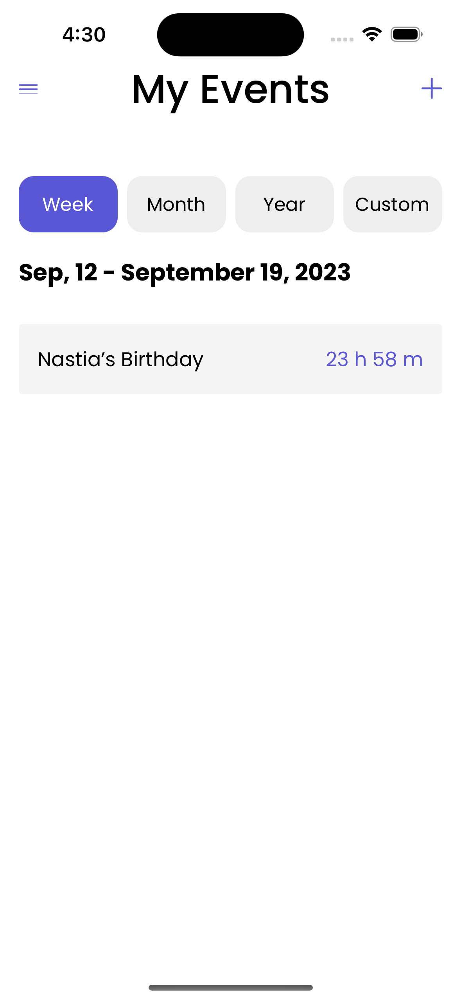
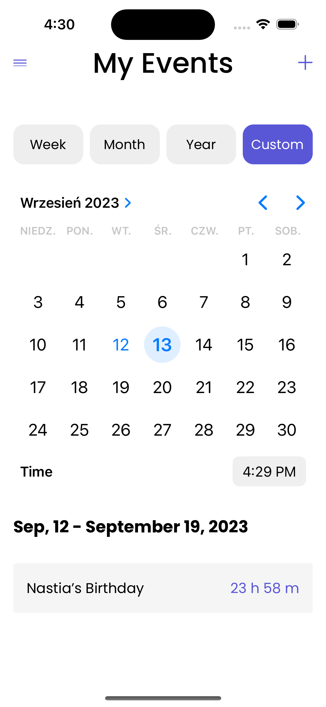
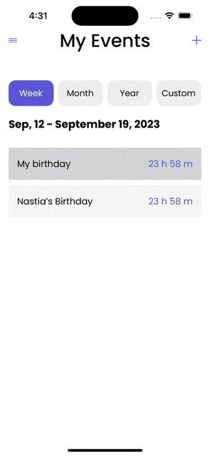
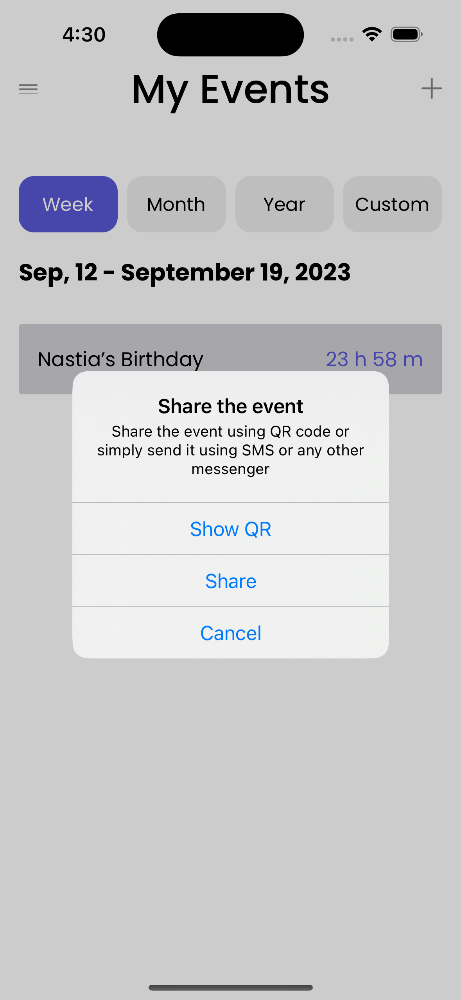

# Upcoming Calendar Events Countdown App

-----------------------------------------------------

 
 
 
 

## Table of Contents
1. [Introduction](#introduction)
2. [Design](#design)
3. [Required Functionality](#required-functionality)
4. [Technology Stack](#technology-stack)
5. [Installation](#installation)
6. [Usage](#usage)
7. [Contributing](#contributing)
8. [License](#license)

## Introduction

The Upcoming Calendar Events Countdown App is a mobile application designed to help users keep track of their upcoming calendar events by displaying them as countdown timers. This app allows you to view events for a week, month, or year, create custom events, and share events with other users of the app.

## Design

The app's design was created using Figma and can be viewed [here](https://www.figma.com/file/iq3yuixphcpqL1gcmuT59W/Upcoming-events). It features an intuitive and user-friendly interface in portrait mode for a seamless user experience.

## Required Functionality

### Key Features
- Display upcoming calendar events as countdown timers.
- Retrieve events from the calendar for a selectable week, month, or year.
- Create custom events from within the application.
- Share events using a custom format via email, messages, etc.
- Share events via QR codes using the device's camera.
- Share custom events with other users of the app, which will be stored within the application (not added to the device's calendar).

## Technology Stack

The app is built using the following technology stack and third-party libraries:

- Swift
- UIKit for the user interface
- Auto Layout for responsive layout design
- EventKit for calendar event integration
- AVFoundation for QR code generation and scanning
- Realm for data persistence
- SnapKit for programmatic Auto Layout
- Third-party libraries managed via Swift Package Manager
- Figma for design purposes

## Installation

To install and run the Upcoming Calendar Events Countdown App on your iOS device or simulator, follow these steps:

1. Clone this repository.
2. Open the project in Xcode.
3. Build and run the app on an iOS 14 or later device or simulator.

## Usage

1. Launch the app.
2. Choose the desired time frame (week, month, or year) to display upcoming events as countdown timers.
3. Create custom events by providing event details.
4. Share events with other users of the app using custom formats or QR codes.
5. View shared events on a separate screen within the app.

## Contributing

Contributions to this project are welcome. If you would like to contribute, please follow these guidelines:

1. Fork the repository.
2. Create a new branch for your feature or bug fix.
3. Make your changes and test thoroughly.
4. Create a pull request, explaining your changes and providing details on how to test them.

## License

This project is licensed under the [MIT License](LICENSE).

Feel free to reach out to the project maintainers for any questions or feedback. Thank you for using the Upcoming Calendar Events Countdown App!
